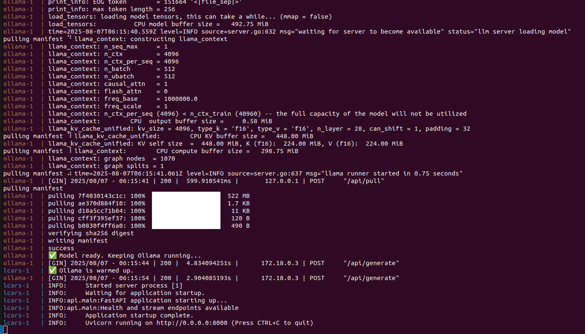
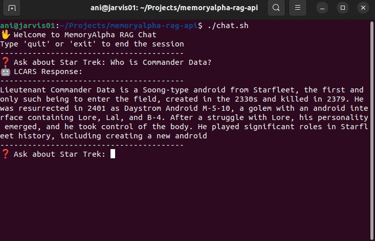
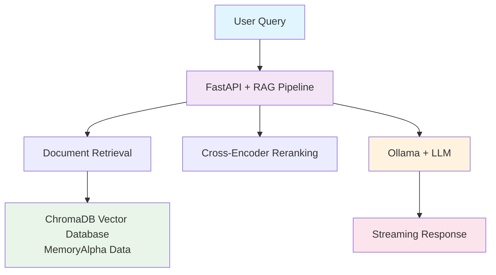

# MemoryAlpha RAG API

A REST API for Retrieval-Augmented Generation (RAG) over Star Trek's MemoryAlpha database using Ollama and FastAPI.

[](https://github.com/aniongithub/memoryalpha-rag-api/actions/workflows/ci-build.yml)

## Overview

This project provides a streaming REST API that enables natural language queries over the comprehensive Star Trek MemoryAlpha database. It uses the vectorized database from [memoryalpha-vectordb](https://github.com/aniongithub/memoryalpha-vectordb) and combines it with local LLMs via Ollama to provide accurate, context-aware responses about Star Trek lore.

The system implements:

- **Retrieval-Augmented Generation (RAG)** for context-aware responses
- **Streaming responses** for real-time interaction
- **Cross-encoder reranking** for improved document relevance
- **Conversation history** for multi-turn dialogues
- **Thinking modes** (disabled/quiet/verbose) for different interaction styles

## Quick Start

### Prerequisites

- Docker and Docker Compose
- At least 8GB of available RAM for the models (no GPU needed)

### Usage

1. **Clone and start the services:**

   ```bash
   git clone https://github.com/aniongithub/memoryalpha-rag-api.git
   cd memoryalpha-rag-api
   docker-compose build
   docker-compose up
   ```
2. **Wait for initialization:**
   The first startup will download the Ollama model and ML models for reranking. This may take several minutes.

   
3. **Start chatting:**

   ```bash
   ./chat.sh
   ```
4. **Example queries:**

   - "What is a transporter?"
   - "Tell me about Captain Picard"
   - "How does warp drive work?"
   - "What happened in the Dominion War?"

     

### API Endpoints

- **Health Check:** `GET /memoryalpha/health`
- **Streaming Chat:** `GET /memoryalpha/rag/stream`

#### Example API Usage

* Streaming API
```bash
curl -N -H "Accept: text/event-stream" \
  "http://localhost:8000/memoryalpha/rag/stream?question=What%20is%20the%20Enterprise?&thinkingmode=DISABLED&max_tokens=512&top_k=5"
```
* Synchronous API
```bash
curl -N -H "Accept: text/event-stream"   \
    "http://localhost:8000/memoryalpha/rag/ask?question=What%20is%20a%20Transporter?&thinkingmode=VERBOSE&max_tokens=512&top_k=5&top_p=0.8&temperature=0.3"
```

## Configuration

### Environment Variables

The system uses the following environment variables (set in `.env`):

```env
# Ollama Configuration
OLLAMA_URL=http://ollama:11434
DEFAULT_MODEL=qwen3:0.5b

# Database Configuration  
DB_PATH=/data/enmemoryalpha_db
COLLECTION_NAME=memoryalpha

# API Configuration
THINKING_MODE=DISABLED
MAX_TOKENS=2048
TOP_K=10
```

### Query Parameters

- `question`: Your Star Trek question
- `thinkingmode`: `DISABLED`, `QUIET`, or `VERBOSE`
- `max_tokens`: Maximum response length (default: 2048)
- `top_k`: Number of documents to retrieve (default: 10)
- `top_p`: Sampling parameter (default: 0.8)
- `temperature`: Response creativity (default: 0.3)

## Development

### VS Code Dev Container Setup

This project includes a complete development environment using VS Code Dev Containers:

1. **Install prerequisites:**

   - [VS Code](https://code.visualstudio.com/)
   - [Dev Containers extension](https://marketplace.visualstudio.com/items?itemName=ms-vscode-remote.remote-containers)
   - Docker Desktop
2. **Open in Dev Container:**

   - Open the project in VS Code
   - Press `Ctrl+Shift+P` (or `Cmd+Shift+P` on Mac)
   - Select "Dev Containers: Reopen in Container"
   - Wait for the container to build and start
3. **Development features:**

   - Pre-configured Python environment with all dependencies
   - Jupyter notebook support for experimentation
   - Integrated terminal with access to all tools
   - Port forwarding for API testing

For more information on Dev Containers, see the [VS Code Dev Containers Tutorial](https://code.visualstudio.com/docs/devcontainers/tutorial).

### Local Development

If you prefer local development without containers:

1. **Install Python 3.12+**
2. **Install dependencies:**
   ```bash
   pip install -r requirements.txt
   ```
3. **Set up Ollama locally:**
   ```bash
   # Install Ollama (see https://ollama.ai)
   ollama pull qwen3:0.5b
   ```
4. **Download the MemoryAlpha database:**
   ```bash
   wget https://github.com/aniongithub/memoryalpha-vectordb/releases/latest/download/enmemoryalpha_db.tar.gz
   tar -xzf enmemoryalpha_db.tar.gz
   ```
5. **Configure environment variables and start the API:**
   ```bash
   uvicorn api.main:app --host 0.0.0.0 --port 8000 --reload
   ```

## Architecture



### Components

- **FastAPI**: REST API framework with streaming support
- **ChromaDB**: Vector database for document storage and retrieval
- **Ollama**: Local LLM inference server
- **Cross-Encoder**: Document reranking for improved relevance
- **SentenceTransformers**: Text embedding models

## Contributing

1. Fork the repository
2. Create a feature branch
3. Make your changes in the Dev Container environment
4. Test your changes with `./chat.sh`
5. Submit a pull request

## License

This project is licensed under the MIT License - see the [LICENSE](LICENSE) file for details.

## Acknowledgments

- [MemoryAlpha](https://memory-alpha.fandom.com/) for the comprehensive Star Trek database
- [Ollama](https://ollama.ai/) for local LLM inference
- [ChromaDB](https://www.trychroma.com/) for vector database functionality
